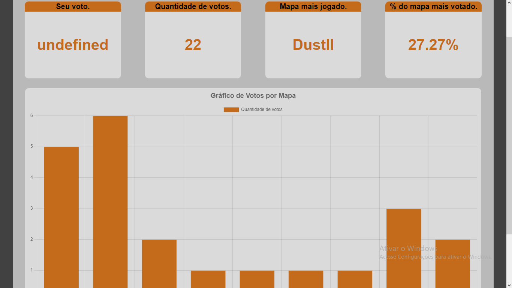
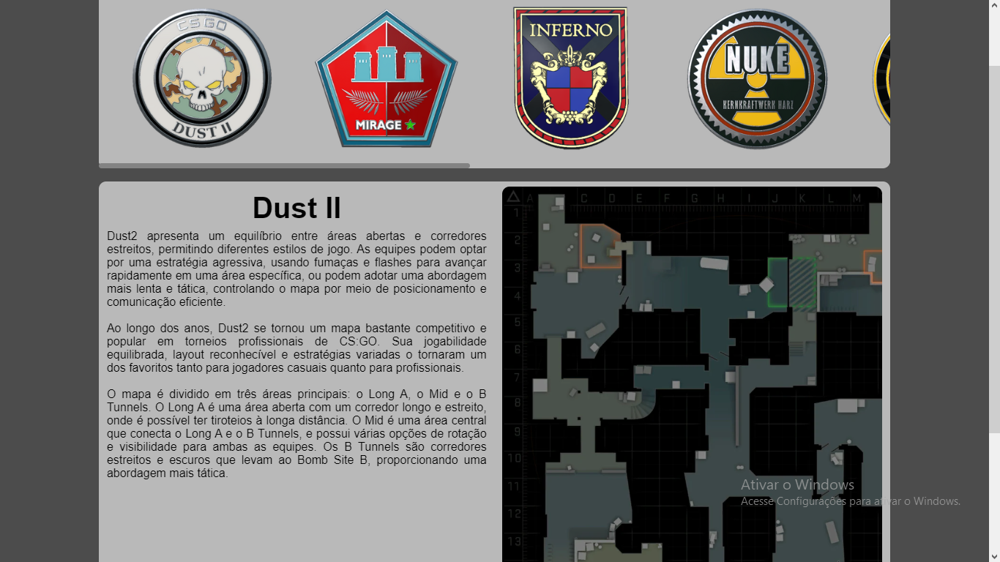

# CounterNet
 Este é um projeto que tem como objetivo falar sobre o Counter Strike Global Offensive (CSGO).

Visualisação de dados: 

Informações sobre os mapas:

## Ferramentas utilizadas 

          
          
